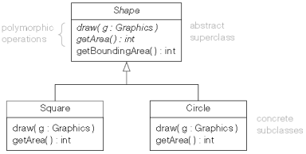

= Compare Object Oriented Programming in Go with TypeScript
Alexander Zeug <Alexander.Zeug@stud.th-rosenheim.de>
0.1, January 10, 2020
:toc:
:icons: font
:quick-uri: https://github.com/AlexanderZeug/cp_paper

*Abstract:* 

This paper is a short comparison of the object oriented programming in the programming language Go and the script language TypeScript. It compares and anlyses the general concepts of object oriented programming. Further it gives an short overview for both languages.

'''

== Motivation

Two of the most rising programming languages are _Go_ and _TypeScript_ (TS). They both seem to use the concept of object oriented programming (OOP), which is a common feature for modern programming languages. Also OOP is a popular feature for a lot of developers, who are choosing a programming language for a project. Because the concept of OOP makes it for people easier to transform a complex task into a working software. The two programming languages are both backed by big IT companies - GO was developed by Google and TypeScript by Microsoft - who were not happy with available programming languages. Both are getting over time more and more popular to other developers. One of the reason for the popularity is the favoured feature of object oriented programming. But these languages are very different: TypeScript is based on ECMA-Script and Go is acompletly new programming language. Therefore the implemetation of OOP is different and will be analyzed.

== The general concepts of object oriented programming

There are some features in the programm languages, which are indicators for object oriented programming languages. But there are also different grades of implementation for OOP. All object-oriented programming languages - no matter what grade of implementation - do also include other concepts of programming languages, like Variables or Pocedures. But there are some importatn features, which do indicate the object orientation. These features are:

* Encapsulation
* Abstraction
* Inheritance
* Polymorphism. 

These four principles are the base for object orientation, but they can look very different in each interpretation. footnote:cite5[Rouse, Margaret (2020): object-oriented programming (OOP), https://searchapparchitecture.techtarget.com/definition/object-oriented-programming-OOP (02.01.2021)] A way to visualize the OOP is the use of the Unified Modeling Language (UML). With this notation you can display the different concepts and use to develop systems.

=== Abstraction

Abstraction in OOP describes the ability to create a model for an part of the solution. The language-specific features are the base of the implementation. It is also described as the process of hiding the details from outside the part. So it simplifies it in the manner, that you only need to understand it a little bit and not he whole way. The concept of abstraction is implemented as properties and methods of a class. footnote:cite6[Pankaj: What is Abstraction in OOPS?, https://www.journaldev.com/33191/what-is-abstraction-in-oops (02.01.2021)]
Further this means that only the important data is showed und the unnescassary things are hidden. As a result this means that a user does not need to know what happens in the background and only needs to know how to use the thing. footnote:cite7[Singh, Chaitanya: OOPs in Java: Encapsulation, Inheritance, Polymorphism, Abstraction, https://beginnersbook.com/2013/03/oops-in-java-encapsulation-inheritance-polymorphism-abstraction/ (03.01.2021)]
The concept of abstraction is more concerned with the ideas rather than events. Often it is archievied through abstract classes ot interfaces. footnote:cite8[NerdVision (Nick) (2020): Polymorphism, Encapsulation, Data Abstraction and Inheritance in Object-Oriented Programming, https://www.nerd.vision/post/polymorphism-encapsulation-data-abstraction-and-inheritance-in-object-oriented-programming (03.01.2021)]
So abstraction is a way of creating a simple model of a more complex real-world entities, with the most important properties. The entities are define a complex data types and are often understood like a custom data type. This is often represented with the keyword _class_. footnote:cite9[Kukurba, Viktor (2018): Object-oriented programming in JavaScript #1. Abstraction., https://medium.com/@viktor.kukurba/object-oriented-programming-in-javascript-1-abstraction-c47307c469d1 (02.01.2021)]

=== Inheritance

The concept of inheritance in OOP can be described as the interaction with other objects by using properties or functionality from another and is contained in many programming languages. The main use is the reusability of objects. For a inheritance are two classes necessary. The base or parent class and the child class. The parent class provides the properties and functionality, which the child class inherits from. It can be described with the real-world parent and child. The child often inherits attributes like hair coloor, language and so on to ther child or children.  footnote:cite8[] A further advantage of inheritance is to avoid code duplication, but also to use the parent code and extend it for the child object. The keyword to inherit from another class is often _extends_ like in Java or JavaScript. footnote:cite10[Kukurba, Viktor (2018): Object-oriented programming in JavaScript #2. Inheritance., https://medium.com/@viktor.kukurba/object-oriented-programming-in-javascript-2-inheritance-447368f57a26 (04.01.2021)] This all means that there are distinct relationships between classes with certain hierarchy. But this forces a careful analysid upfront to create a useful and right system. This produces a good level of accuracy. footnote:cite5[]

=== Polymorphism

A further important concept for object oriented programming is the Polymorphism. This is the ability to create a property, function or object that has more than one realization. In other words this means a type of object (class) can implement the same functionality, but works different. This approach simplifies the source code as different classes have the same method, but the method in each class works different. footnote:cite11[Kukurba, Viktor (2018): Object-oriented programming in JavaScript #3. Polymorphism., https://medium.com/@viktor.kukurba/object-oriented-programming-in-javascript-3-polymorphism-fb564c9f1ce8 (04.01.2021)]
Short this means different objects can take more than one form of a method, variable and so on. The program itself decides which form will it be and does so to avoid the duplication of code. footnote:cite5[]
But not all features have to be different in the child class. There is also the ability to keep the features of the parent class.

There are also two different types of polymorphism. First the run time polymorphism can take different forms while executing the code. The other is the compile time polymorhism and this can take the different forms only during the compilation. footnote:cite8[]

=== Encapsulation

The encapsulation, also known as _information hiding_, is the ability to hide implementation details with the intention to reduce complexity. Most common are the two levels, private and public. Private means that only the object itself can access it, while with public every object has access to the function or variable. footnote:cite8[] The encapsulation is an import step for privcacy. But there is often the explanation, that it is an approach for restricting direct access to some of the data structures, like methods or properties. footnote:cite12[Kukurba, Viktor (2018): Object-oriented programming in JavaScript #4. Encapsulation., https://medium.com/@viktor.kukurba/object-oriented-programming-in-javascript-4-encapsulation-4f9165cd26f9(04.01.2021)]
Encapsulation also provides data binding with the code that can manipulate the data. Furthermore it has the ability to keep the data and the code safe from external manipulation. So it can prevent the chance of data through side effects. footnote:cite7[]

=== Combining the concepts

The previous described concepts often come as one and are not always implemented the same way, but they always try to archieve the same goals. So the main ideas are to simplify the code, enhance code reusability, make it better extendable and secure the application. And only if these four concepts are contained in a programming language it is possible to make the "clean code". Also it is necessary for the developer to use these features of a language, otherwise it has no sense to use a OOP-language. Each concept is able to provide the majority of an advantage, but it is the combination of all concepts, which provides the best solution. Abstraction is usefull to show only the necessary things for the user, because the user does not need to know how the things work in the background. Inheritance aims mainly to reduce code reusability because of the hierarchy. Polymorphism has the advantage to have different meanings or functions and Encapsulation provides a huge pro for security.

=== Visualizing the concepts

A great way to visualize the concepts is the usage of UML diagrams. With the Unified Modeling Language (UML) every concept of the OOP can be visualized, but is not always recognizeable at first. Often you have to analyse the complete UML diagram to recognize the concepts. It is used to specify, visualize, construct and document the artifacts of software. 

The inheritance is relatively easy to recognize because it is visualized by arrows from the child class to the parent class as seen in the link:#img-inheritance[image below]. footnote:cite13[Marbus, Alex (2000): OOP and UML, https://www.codeproject.com/Articles/618/OOP-and-UML#Inheritance]

.UML Diagram displaying the inheritance of animals
[#img-inheritance]
image::inheritance.png[Image displaying the hierarchy in UML]

Also very easy it is to see the encapsulation. This is often displayed with with a "-" for private or "+" for public in front of a variable or function. There are also other security levels, but they depend on the programming language. This can bes seen in the image below link:#img-class[image below]. footnote:cite14[Tutorialspoint: UML - Basic Notations, https://www.tutorialspoint.com/uml/uml_basic_notations.htm (04.01.2021)]

.UML Diagram displaying a class
[#img-class]
image::class.jpg[Image displaying a class in UML]

The polymorphism is often displayed with abstract classes or interfaces. These can provide a general implementation, other functions or variables. The other class can then implement a own form of these. In the link:#img-poly[image below] the abstract class _shape_ provides the operations and the class _sqaure_ and _cirlce_ have their own implementation of the functions _draw()_ and _getArea()_. footnote:cite15[Praveen (2012): Inheritance and polymorphism (S6 IT), https://praveenthomasln.wordpress.com/2012/03/01/inheritance-and-polymorphism-s6-it/ (04.01.2021)]

.UML Diagram displaying a polymorphism
[#img-poly]

The abstraction are visualized by the classes and interfaces of the UML diagrams, as seen in the images above.

== The reasons for OOP in Go and TS

The concept of using object oriented programming is very common, but there are also new langauges with no OOP. So what where the main reasons for OOP in Go and TypeScript respectively JavaScript. 

=== Reasons for OOP concepts in TypeScript

TypeScript was developed by Microsoft with the main idea to extend JavaScript with a type-check. Through this the developers can avaoid a lot of errors. This means in large JavaScript applications it is more likely to avoid errors because of a minor change of type in a file and the other many files have through type-checks a big advantage. footnote:cite16[TypeScript: Why TypeScript, https://www.typescriptlang.org/why-create-typescript (04.01.2021)]
JavaScipt (JS) is based on ECMAScript, which standardizes the base for JS. TypeScript is based on JavaScript, as JS is the most common interpretation of ECMAScript.

=== Reasons for OOP concepts in GO

Go is a pretty new language and is not based on any other languages. Because of that they could and can implement concepts as they want to. Because of this freedom they choose not to implement a classic approach to object oriented programming. They answer the question "Is Go an object oriented language" with "Yes and no" theirselfs. They further explain Go has types and methods, but no type hierarchy. This means you can have an object oriented style of programming. With interfaces Go provides another approach, which they think is easier to use. Further they give the ability to satisfies any interface with a subset of its methods. This evokes the advantage of a less complex inheritance. footnote:cite17[Golang.org: Frequently Asked Questions (FAQ) - Types, https://golang.org/doc/faq (04.01.2021)]

== The concepts in Go and TypeScript

The founder of both OOP language used very different approaches to integrate the concepts of object oriented programming into their languages and had different difficulties to implement the concepts. For TypeScript they had to watch for the JavaScript, because it is based on it. On the other side the developers of Go had the freedom to choose how they want to realize the concepts.

=== Realisation of OOP concepts in TypeScript

The concepts of OOP in TypeScript are based on the specification of ECMAScript and with ES6, the sixth version of ECMAScript, came the keyword _class_ to JavaScript. TypeScript used the _class_ and added to it public, private and other keywords. With these keywords you can implement a class in TypeScript and create instances of classes with the constructor. footnote:cite22[Maxwell, Sean (2018): TypeScript Object-Oriented Concepts in a Nutshell, https://levelup.gitconnected.com/typescript-object-oriented-concepts-in-a-nutshell-cb2fdeeffe6e (04.01.2021)]

This basic example link:#code-ts-oop[below] contains all the concepts of object oriented programming. The different classes represent the concept of abstraction.

.Simple Example with concepts of OOP in TypeScript
[#code-ts-parent]
----
class Animal { <1>
    private age: number; <3>

    constructor(age: number) {
        this.age = age;
    }

    public setAge(age: number) { <4>
        this.age = age;
    }

    public getAge(): number {
        return this.age;
    }
}

interface IMakeSound { <5>
    makeSound(): void;
}

class Dog extends Animal implements IMakeSound{ <2> <6>
    private colour: string;

    constructor(age: number, colour: string) {
        super(age);
        this.colour = colour;
    }

    public setColour(colour: string) {
        this.colour = colour;
    }

    public getColour(): string {
        return this.colour;
    }

    public makeSound(): void { <7>
        console.log('Wuff');
    }
}

let laika = new Dog(13, "black"); <8>
laika.makeSound();
console.log(laika.getAge());
console.log(laika.getColour());

/** 
 * output:
 *  Wuff
 *  13
 *  black
 */
----
<1> The class _Animal_ is a parent class to all animals that could exist and for the class _Dog_ especially. So these two classes represent the model of the animal rich. Further this hierarchy also represents the inheritance for the animals. 
<2> The child class _Dog_ extends the class _Animal_, which is a basic model. With the declaration of the class _Dog_ the inheritance is declared.
<3> The _private_ attribute _age_ shows the concept of data hiding, because it should not be allowed to change this easy the age of a animal.
<4> The _public_ function _setAge(age: number)_ is a compensation for the private Attribute _age_, because with this concept you can add validation to check the new age.
<5> This declares the interface _IMakeSound_ as base for polymorphism.
<6> The keyword _implements_ indicatres that the _Dog_ must have the function _MakeSound()_ from the interface _IMakeSound_
<7> This implements the interface _IMakeSound_ with the function _MakeSound()_ as part of the concept polymorphism.
<8> This section shows the usage of the objects in TypeScript with the output below.

This shows the concepts are pretty simular to other object oriented languages. Also it is easy to recognise the concepts in the source code and are based on the classic JavaScript keywords. For all four listed concepts are keywords in TypeScript to indicate the occurence of the certain concept. The TypeScript code is only for development use, for production the TypeScript code will be compiled to JavaScript code.

=== Implementation of OOP concepts in Go

First example is link:#code-go-oop[here]

.Simple Example with concepts of OOP in Go
[#code-go-oop]
----
package main

import "fmt"

type Animal struct { // <1>
	age int // <3>
}

func NewAnimal(age int) Animal {
	a := Animal{}
	a.age = age
	return a
}

func (a Animal) SetAge(age int) { // <4>
	a.age = age
}

func (a Animal) GetAge() int {
	return a.age
}

type IMakeSound interface { // <5>
	makeSound()
}

type Dog struct {
	Animal // <2>
	colour string
}

func NewDog(age int, colour string) Dog {
	d := Dog{}
	d.age = age
	d.colour = colour
	return d
}

func (d Dog) SetColour(colour string) {
	d.colour = colour
}

func (d Dog) GetColour() string {
	return d.colour
}

func (d Dog) MakeSound() { // <6>
	fmt.Println("Wuff")
}

func main() { // <7>
	var laika = NewDog(13, "black")
	laika.MakeSound()
	fmt.Println(laika.GetAge())
	fmt.Println(laika.GetColour())
}

/*
output:
 Wuff
 13
 black
*/
----

<1> The expression _type Animal struct_ declares the class for the object. It contains the necessary attributes for the object and further below the implementation of the associated functions.
<2> The inheritance in Go is replaced by the embedding of other structures, but offers the same functionality. With this you can embed a other struct to the class and use its attributes as the attributes of the own class. 
<3> With the lower case attribute name of _age_ you can specify a private attribute. Only if you work on the object you can access the attribute directly. In order to access them you need to write public getter and setter. Onl
<4> With the upper case name _SetAge(age int)_ you have a public available function to set a new age to the _Animal_.In order to work with a object you need to add the type of a object between the _func_ and the function name to make the function working for these kind of objects. The alternative would be to hand the object as an argument of the function to change this object.
<5> The polymorphism is in Go easy to recognize because you can define a interface simular to class. With the expression _type IMakeSound interface_ the interface for the function _MakeSound()_ is created.
<6> The implementation of the interface _IMakeSound_ is easy because it is only necessary to implement function with the same name and arguments. It is not needed to mention the name of the interface, you want to implement.
<7> This section shows the usage of the objects in Go with the output below.

This all seems like the proof that Go is an object oriented programming language, but it isn't. The point, which proofs this is, is the fact that there is no inheritance. Although they found a solution to embed a struct into another struct. With this kind of hierarchy you can implement some kind of inheritance,but in fact it isn't one. The other concepts are also contained with a different approach than other programming languages. The possibility to embed another struct into a struct is necassary for the comfort of new Go developers. New developers come from OOP languages and have a certain skill set with techniques that they used in other languages, but those wouldn't work in Go. In order to make it easier for Go newbies the embedding of other structs is a good solution. footnote:cite19[Lukac, Lukas (2018): Is Go an Object Oriented language, https://medium.com/gophersland/gopher-vs-object-oriented-golang-4fa62b88c701 (04.01.2021)]

== Conclusion for OOP concepts in Go and TS

As both are languages are pretty popular and are gaining new followers, it is interisting how both languages differ. TypeScript is based on another language and has therefore not the freedom to do what they want. On the other side is Go a new and independent programming language, so Go can evolve as the founders want it. The main use for Go is the cloud environment and there it is really common to use it in the technologies. With both languages, TS and Go, it is possible to create backend services, but one advantage has TS, because you can use it in website development.

As a result of this analysation you can see although it seems that both use object oriented programming, only TypeScript is a real OOP language. Go is often labeled as a language with OOP, but it isn't really. They unite some concepts of programming languages and some concepts of OOP, but not all. Therefore the right answer to the question "Is Go an object oriented programming language?", you can answer this like the founder of Go with "Yes and no". footnote:cite17[]
